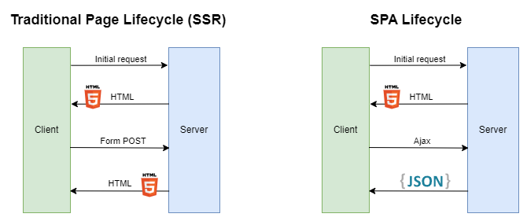
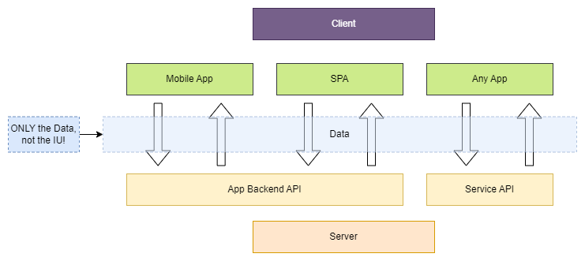
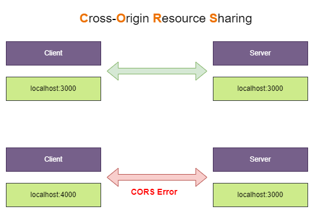

# Example traditional page and spa <!-- omit in toc -->

## Contents <!-- omit in toc -->

- [1. Traditional Web Apps VS Single Page Apps](#1-traditional-web-apps-vs-single-page-apps)
  - [1.1. When use SSR and SPA](#11-when-use-ssr-and-spa)
- [2. API](#2-api)
- [3. API Architecure Styles](#3-api-architecure-styles)
  - [3.1. REST](#31-rest)
    - [3.1.1. Data formats](#311-data-formats)
    - [3.1.2. Routing](#312-routing)
    - [3.1.3. Http Methods (Http Verbs)](#313-http-methods-http-verbs)
    - [3.1.4. REST Principles](#314-rest-principles)
    - [3.1.5. CORS](#315-cors)
  - [3.2. SOAP](#32-soap)
  - [3.3. GRPC](#33-grpc)
  - [3.4. GraphQL](#34-graphql)

# 1. Traditional Web Apps VS Single Page Apps

- There are two general approaches to building web applications today:
  - **Traditional web applications** that perform most of the application logic on the server (Server Side Rendering (SSR)).
  - **Single-page applications (SPAs)** that perform most of the user interface logic in a web browser, communicating with the web server primarily using web APIs.
    

## 1.1. When use SSR and SPA

- Use traditional web applications when:
  - Your application's client-side requirements are simple or even read-only.
  - Your application needs to function in browsers without JavaScript support.
- Use a SPA when:
  - Your application must expose a rich user interface with many features.
  - Your team is familiar with JavaScript, TypeScript, or Blazor WebAssembly development.
  - Your application must already expose an API for other (internal or public) clients.
    - This is can be controlled...

# 2. API

# 3. API Architecure Styles

## 3.1. REST

- REST APIs are all about data, no UI logic is exchanged.
- JSON is the common data format that is used both for requests and responses.
- REST APIs are decoupled from the clients that use them.

### 3.1.1. Data formats

### 3.1.2. Routing

### 3.1.3. Http Methods (Http Verbs)

- `GET` - Get a Resource from the Server.
- `PATCH` - Update parts of an existing Resource on the Server.
- `POST` - Post a Resource to the Server (i.e. create or append Resource).
- `PUT` - Put a Resource onto the Server (i.e. create or overwrite a Resource).
- `DELETE` - Delete a Resource on the Server.
- `OPTIONS` - Determine whether follow up Request is allowed (sent automatically).

### 3.1.4. REST Principles

- **Uniform Interface**
  - Clearly defined API endpoints with clearly defined request + response data structure.
- **Stateless Interactions**
  - Server and client don’t store any connection history, every request is handled seperately.
- **Cacheable**
  - Servers may set caching headers to allow the client to cache responses.
- **Client-Server**
  - Server and client are separated, client is not concerned with persistent data storage.
- **Layered System**
  - Server may forward requests to other APIs.
- **Code on Demand**
  - Executable code may be transferred from server to client,

### 3.1.5. CORS

- **C**ross-**O**rigin **R**esource **S**haring.
- CORS errors occur when using an API that does not set CORS headers.
  

## 3.2. SOAP

## 3.3. GRPC

## 3.4. GraphQL
