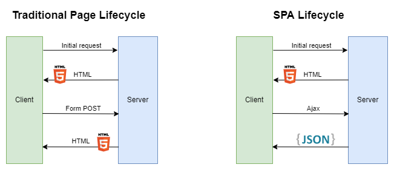

# Example traditional page and spa <!-- omit in toc -->

## Contents <!-- omit in toc -->

- [1. What is this project](#1-what-is-this-project)
- [2. Choose Between Traditional Web Apps and Single Page Apps](#2-choose-between-traditional-web-apps-and-single-page-apps)
- [3. How is it organized](#3-how-is-it-organized)

# 1. What is this project

- This is a project that shows the difference between Traditional Page Lifecycle (SSR) and Spa (Simple Page Application) Lifecycle.

# 2. Choose Between Traditional Web Apps and Single Page Apps

- There are two general approaches to building web applications today:
  - Traditional web applications that perform most of the application logic on the server (Server Side Rendering (SSR)).
  - Single-page applications (SPAs) that perform most of the user interface logic in a web browser, communicating with the web server primarily using web APIs.
- Use traditional web applications when:
  - Your application's client-side requirements are simple or even read-only.
  - Your application needs to function in browsers without JavaScript support.
- Use a SPA when:
  - Your application must expose a rich user interface with many features.
  - Your team is familiar with JavaScript, TypeScript, or Blazor WebAssembly development.
  - Your application must already expose an API for other (internal or public) clients.
    - This is can be controlled...

# 3. How is it organized

- SpaLifecyle (.NET 6.0 / webapi + angular)
- TraditionalPageLifecycle (.NET 6.0 / webapp)
